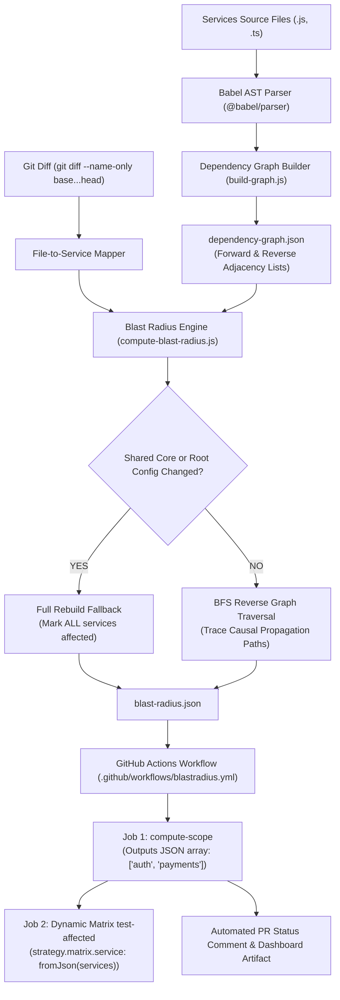

# 💥 BlastRadius: Dependency-Graph-Based Selective CI Testing for Monorepos

[](https://github.com)
[](https://opensource.org/licenses/MIT)
[](https://nodejs.org)
[](https://babeljs.io)

**BlastRadius** is an intelligent, dependency-graph-driven selective CI testing engine for poly-service monorepos. It eliminates redundant test runs by computing the precise direct and transitive "blast radius" of any git changeset—dynamically triggering containerized test matrices **only** for affected services while safely skipping unaffected modules.

---

## 📑 Table of Contents
- [1. The Problem Statement](#1-the-problem-statement)
- [2. Architectural Overview](#2-architectural-overview)
- [3. Demo Monorepo Topology](#3-demo-monorepo-topology)
- [4. Quick Start & Local Setup](#4-quick-start--local-setup)
- [5. Worked Walkthroughs](#5-worked-walkthroughs)
  - [Scenario A: Changing `search`](#scenario-a-changing-search-isolated)
  - [Scenario B: Changing `auth`](#scenario-b-changing-auth-transitive-propagation)
  - [Scenario C: Changing `shared`](#scenario-c-changing-shared-full-rebuild-fallback)
- [6. Dynamic GitHub Actions Matrix Workflow](#6-dynamic-github-actions-matrix-workflow)
- [7. Interactive Visualization Dashboard](#7-interactive-visualization-dashboard)
- [8. Metrics & Historical Savings](#8-metrics--historical-savings)
- [9. Trade-offs & Known Limitations](#9-trade-offs--known-limitations)

---

## 1. The Problem Statement

In standard monorepo setups, CI pipelines trigger full builds and runs for every service on every commit or PR. 

### The Naive CI Anti-Pattern:
Consider a monorepo with 5 microservices, each requiring ~2.5 minutes for Docker image assembly and test suite execution:
- An engineer modifies a typo in `services/search/index.js` (an independent, standalone service).
- **Naive CI Action**: Builds and runs Docker test suites for `auth`, `payments`, `notifications`, `search`, and `shared`.
- **Total Duration**: ~12.5 CPU minutes per push.
- **Wasted Time**: **80% of CI compute was completely wasted** re-verifying services that could not possibly be impacted by the change.

### The BlastRadius Solution:
BlastRadius parses the monorepo's abstract syntax tree (AST), extracts literal import/require dependencies, constructs bidirectional dependency graphs, and executes a breadth-first search (BFS) on the reverse dependency graph from changed files. Only services in the active blast radius are tested.

---

## 2. Architectural Overview



---

## 3. Demo Monorepo Topology

The repository contains 5 services under `/services/` with real cross-service module dependencies:

| Service | Category | Imports From | Downstream Dependents | Responsibility |
| :--- | :--- | :--- | :--- | :--- |
| **`shared`** | Core Utility | _None_ | `auth`, `payments`, `notifications` | Shared logging, currency formatting, email regex |
| **`auth`** | Core Domain | `shared` | `payments` | JWT generation and signature verification |
| **`payments`** | Core Domain | `auth`, `shared` | `notifications` | Transaction authorization and ledger processing |
| **`notifications`** | Edge Domain | `payments`, `shared` | _None_ | Payment receipt dispatch & email delivery |
| **`search`** | Standalone | _None_ | _None_ | Product catalog query engine & indexer |

### Structural Dependency Graph:
```
           [shared] (core utility)
          /   |   \
         /    |    \
        v     v     v
     [auth]   |      |
       |      |      |
       v      v      |
    [payments]       |
       |             |
       v             v
    [notifications] <+
    
    [search] (isolated)
```

---

## 4. Quick Start & Local Setup

### Prerequisites
- Node.js >= 22.0.0
- Git

### 1. Install Monorepo Root Dependencies
```bash
npm install
```

### 2. Run All Service Unit Tests Locally
All services use Node.js built-in zero-dependency test runner (`node:test`):
```bash
npm run test:all
```

### 3. Generate Static AST Dependency Graph
Statically analyzes imports across all services and outputs `dependency-graph.json`:
```bash
npm run graph
```

### 4. Compute Blast Radius
Computes affected services from git changes (or pass `--files` or `--base`/`--head`):
```bash
# Test with simulated git diff:
npm run blast-radius -- --files "services/auth/index.js"
```

### 5. Launch Interactive Dashboard
```bash
npm run dashboard
# Open http://localhost:3000/dashboard/index.html in browser
```

---

## 5. Worked Walkthroughs

### Scenario A: Changing `search` (Isolated)
- **Changed File**: `services/search/index.js`
- **Reverse Dependencies of search**: `[]`
- **Blast Radius Result**:
  - **Directly Changed**: `search`
  - **Affected Services**: `search`
  - **Skipped Services**: `auth`, `notifications`, `payments`, `shared`
  - **CI Time Saved**: **~80% (4 out of 5 services skipped, saving ~10 min)**

### Scenario B: Changing `auth` (Transitive Propagation)
- **Changed File**: `services/auth/index.js`
- **Reverse Graph Traversal**:
  1. `auth` is directly changed.
  2. `payments` depends on `auth` $\rightarrow$ `payments` is affected.
  3. `notifications` depends on `payments` $\rightarrow$ `notifications` is affected.
- **Blast Radius Result**:
  - **Directly Changed**: `auth`
  - **Affected Services**: `auth`, `payments`, `notifications`
  - **Skipped Services**: `search`, `shared`
  - **Causal Path**: `notifications -> payments -> auth (changed)`
  - **CI Time Saved**: **~40% (2 out of 5 services skipped, saving ~5 min)**

### Scenario C: Changing `shared` (Full Rebuild Fallback)
- **Changed File**: `services/shared/index.js`
- **Fallback Rule**: Because `shared` provides cross-cutting foundational logic, any change triggers a safety fallback.
- **Blast Radius Result**:
  - **Directly Changed**: `shared`
  - **Affected Services**: `auth`, `notifications`, `payments`, `search`, `shared` (All 5 services)
  - **Skipped Services**: `0`
  - **CI Time Saved**: **0% (100% full rebuild triggered safely)**

---

## 6. Dynamic GitHub Actions Matrix Workflow

The workflow file [`.github/workflows/blastradius.yml`](file:///.github/workflows/blastradius.yml) executes a two-job strategy:

1. **`compute-scope`**:
   - Checks out the repository with `fetch-depth: 0` to preserve complete git history.
   - Runs `build-graph.js` and `compute-blast-radius.js`.
   - Exports the affected services as a JSON array string directly to `$GITHUB_OUTPUT`:
     ```bash
     echo "services=[\"auth\",\"payments\",\"notifications\"]" >> $GITHUB_OUTPUT
     ```
   - Posts a rich markdown comment on the pull request with a complete impact table and time-saved metrics.

2. **`test-affected`**:
   - Uses GitHub Actions' dynamic matrix feature:
     ```yaml
     strategy:
       matrix:
         service: ${{ fromJson(needs.compute-scope.outputs.services) }}
     ```
   - Dynamically spawns parallel runners **only** for the affected services:
     ```bash
     docker build -t blastradius-${{ matrix.service }}:latest -f services/${{ matrix.service }}/Dockerfile .
     docker run --rm blastradius-${{ matrix.service }}:latest
     ```

---

## 7. Interactive Visualization Dashboard

BlastRadius includes an interactive visualization dashboard located at [`dashboard/index.html`](file:///dashboard/index.html):

- **Interactive Topology**: Vis-Network directed graph with physics simulation.
- **State-Based Node Coloring**:
  - 🔴 **Crimson**: Directly changed service (root cause).
  - 🟠 **Amber**: Transitively affected service (rebuild & test required).
  - ⚪ **Charcoal/Gray**: Safely skipped service.
  - 🔷 **Cyan Hexagon**: Core shared package.
- **Real-Time Scenario Simulator**: Test and toggle between scopes (`Current Diff`, `auth changed`, `search changed`, `shared changed`) on the fly.
- **Service Inspector**: Click any node to reveal exact dependency chains, callers, and causal impact reasons.
- **History Ledger**: Track cumulative CI compute minutes saved across runs and PRs.

---

## 8. Metrics & Historical Savings

BlastRadius records every CI invocation into [`metrics-history.json`](file:///metrics-history.json) via `record-metrics.js`:

| Run ID | Branch | Direct Change | Tested Count | Skipped Count | % Saved | Compute Saved |
| :--- | :--- | :--- | :---: | :---: | :---: | :---: |
| `#101` | `feature/search-filter` | `search` | 1 | 4 | **80%** | **+10.0m** |
| `#102` | `fix/token-expiry` | `auth` | 3 | 2 | **40%** | **+5.0m** |
| `#103` | `feature/payment-webhook` | `payments` | 2 | 3 | **60%** | **+7.5m** |
| `#104` | `perf/email-digest` | `notifications` | 1 | 4 | **80%** | **+10.0m** |
| **Total** | **Cumulative CI Impact** | - | - | - | **65% Avg** | **~32.5 mins** |

---

## 9. Trade-offs & Known Limitations

1. **Dynamic / Runtime Coupling**:
   - *Limitation*: Static AST analysis detects code-level `import` and `require` references. It does not automatically detect runtime network coupling (e.g. dynamic HTTP REST endpoints or gRPC URLs read from environment variables).
   - *Mitigation*: Contract testing, OpenAPI schemas, or explicit service metadata files can declare synthetic dependencies for runtime RPCs.

2. **Non-Code / Config Changes**:
   - *Design Choice*: If root files like `package.json`, `package-lock.json`, or root docker configurations change, BlastRadius triggers the safety fallback to rebuild all services.

3. **Multi-Language Monorepos**:
   - *Current Scope*: This implementation uses `@babel/parser` for JavaScript and TypeScript (`.js`, `.ts`, `.jsx`, `.tsx`, `.mjs`, `.cjs`).
   - *Extensibility*: Additional language parsers (e.g. `ast` module for Python, `go/parser` for Go) can easily emit edges into the standard `dependency-graph.json` format.

4. **Git History Availability**:
   - *Requirement*: Shallow clones (`fetch-depth: 1`) do not contain base refs for three-dot diffs (`git diff origin/main...HEAD`). BlastRadius configures `fetch-depth: 0` in GitHub Actions to ensure diff accuracy.

---

## License
MIT License. Created for monorepo efficiency and developer velocity.
